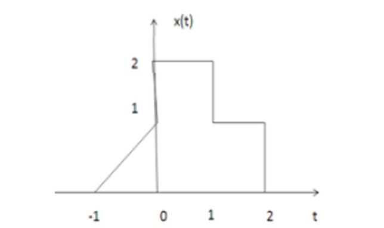
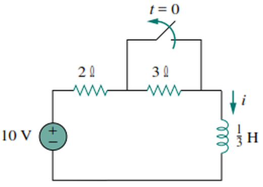
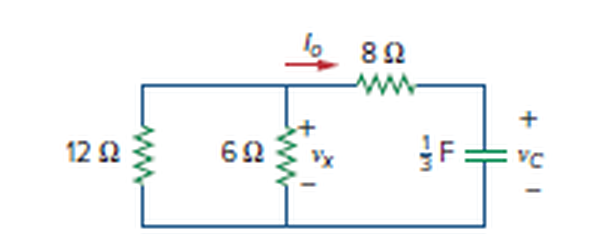

# Module 28 — ELE 712 Tutorial Questions, Solved

The twelve tutorial questions issued by the ELE 712 lecturer (Nigerian Defence
Academy, Department of Electrical/Electronics Engineering), worked in full.

Every numerical answer below has been checked independently. Work each question
on paper before reading the solution — this is the closest thing you have to a
past paper.

---

## Q1 (a) Short notes on any three elementary signals

**Unit step u(t).** Equals 1 for t ≥ 0 and 0 for t < 0. It is the mathematical
model of a switch closing at t = 0, and its practical use is that multiplying
any signal by u(t) forces that signal to start at the origin. Shifted, u(t − a)
switches on at t = a, and differences of shifted steps build any
piecewise-constant waveform.

**Unit impulse δ(t).** Zero everywhere except the origin, where it is unbounded,
and defined by unit **area**: ∫δ(t)dt = 1. It is not an ordinary function — it
is defined entirely by what it does inside an integral, through the sifting
property ∫f(t)δ(t − a)dt = f(a). It is the derivative of the unit step, and its
Laplace transform is 1, which makes it the natural test input for finding a
system's impulse response.

**Unit ramp r(t).** Equals t for t ≥ 0 and 0 for t < 0, so r(t) = t·u(t). It is
the integral of the unit step and the derivative of the unit parabolic function.
A ramp of slope m beginning at t = a is m(t − a)u(t − a).

*(Any three of: step, ramp, impulse, parabolic, sinusoid, real exponential,
complex exponential, rectangular pulse, signum, sinc — see Module 14 for all
ten.)*

## Q1 (b) Relationship between step, ramp and parabolic

They form an **integration chain**, each the integral of the one before:

    u(t) = ∫_{−∞}^{t} δ(τ)dτ
    r(t) = ∫_{−∞}^{t} u(τ)dτ = t·u(t)
    p(t) = ∫_{−∞}^{t} r(τ)dτ = (t²/2)·u(t)

Running the other way, each is the derivative of the next:

    u(t) = dr/dt        r(t) = dp/dt        u(t) = d²p/dt²

and one step further back, δ(t) = du/dt, so δ(t) = d³p/dt³.

So a single relationship generates all four:

    δ(t)  →∫  u(t)  →∫  r(t)  →∫  p(t)

---

## Q2 (a) For the signal of Fig. 1, find x(2t + 3)

**Read the signal off the figure first.**

    x(t) = 2t + 2,   −1 ≤ t ≤ 0        (ramp from 0 up to 2)
           2,         0 ≤ t ≤ 1
           1,         1 ≤ t ≤ 2
           0,         otherwise

**Factor the argument before doing anything else.** This is the step that
decides whether you get it right:

    x(2t + 3) = x(2(t + 1.5))

Read it as: **compress by 2, then shift left by 1.5** — not "shift by 3".

**Method — map the breakpoints.** Every breakpoint t₀ of x(t) moves to wherever
2t + 3 = t₀:

| Breakpoint of x | 2t + 3 = | new t |
|---|---|---|
| −1 | −1 | −2 |
| 0 | 0 | −1.5 |
| 1 | 1 | −1 |
| 2 | 2 | −0.5 |

So the signal now lives on **−2 ≤ t ≤ −0.5**, a quarter of its original width
(halved by the compression) and moved into negative time.

**Result:**

    x(2t+3) = 4t + 8,   −2 ≤ t ≤ −1.5     (substituting: 2(2t+3)+2)
              2,        −1.5 ≤ t ≤ −1
              1,        −1 ≤ t ≤ −0.5
              0,        otherwise

Check the ramp endpoints: at t = −2, 4(−2) + 8 = 0 ✓; at t = −1.5,
4(−1.5) + 8 = 2 ✓ — it still rises from 0 to 2, just four times faster.

> **The common error** is to shift by 3 instead of 1.5. Always write the
> argument as a(t − b/a) first; the shift is b/a, not b.

## Q2 (b) Derive the even and odd parts, then apply to x(n) = {2, 2, 3, 6, 5}

**Derivation.** Any signal splits uniquely into an even and an odd part:

    x(n) = x_e(n) + x_o(n)          … (1)

Replace n by −n:

    x(−n) = x_e(−n) + x_o(−n)

By definition x_e(−n) = x_e(n) and x_o(−n) = −x_o(n), so

    x(−n) = x_e(n) − x_o(n)         … (2)

**Adding** (1) and (2):

    x(n) + x(−n) = 2x_e(n)   ⇒   x_e(n) = ½[x(n) + x(−n)]

**Subtracting** (2) from (1):

    x(n) − x(−n) = 2x_o(n)   ⇒   x_o(n) = ½[x(n) − x(−n)]

> Note the **minus** in the odd part. The lecture notes' derivation reaches
> exactly this, but the final boxed line there is typed with a plus. The check
> is that x_e + x_o must return x(n) — with two pluses it returns
> x(n) + x(−n) instead.

**Application.** With no arrow marked, the convention stated in the lecture
notes is that the first term is n = 0:

    x(0) = 2, x(1) = 2, x(2) = 3, x(3) = 6, x(4) = 5, and zero elsewhere

The reversal x(−n) therefore has those same values at n = 0, −1, −2, −3, −4.

| n | −4 | −3 | −2 | −1 | 0 | 1 | 2 | 3 | 4 |
|---|---|---|---|---|---|---|---|---|---|
| x(n) | 0 | 0 | 0 | 0 | 2 | 2 | 3 | 6 | 5 |
| x(−n) | 5 | 6 | 3 | 2 | 2 | 0 | 0 | 0 | 0 |
| **x_e(n)** | 2.5 | 3 | 1.5 | 1 | **2** | 1 | 1.5 | 3 | 2.5 |
| **x_o(n)** | −2.5 | −3 | −1.5 | −1 | **0** | 1 | 1.5 | 3 | 2.5 |

Three checks, all of which must pass:
- x_e is symmetric about n = 0 ✓
- x_o is antisymmetric, and **x_o(0) = 0** as every odd signal must be ✓
- x_e(n) + x_o(n) = x(n) at every n ✓

*(If the origin is marked elsewhere in the original — say the arrow sits under
the middle term — the same method applies, but shift which value you call x(0)
before reversing. The method does not change; only the bookkeeping does.)*

---

## Q3 Express the sequence of Fig. 2 as a sum of step functions

![Fig 2 — the sequence s[n]](figures/tut-fig2.png)

**Read the sequence:**

| n | ≤ −4 | −3 | −2 | −1 | 0 | 1 | 2 | 3 | ≥ 4 |
|---|---|---|---|---|---|---|---|---|---|
| s[n] | 0 | −1 | −1 | 3 | 3 | 3 | −1 | −1 | 0 |

**The key idea.** In the form s[n] = Σ a_k u[n − k], each step u[n − k] switches
on permanently at n = k. So **a_k is the jump in s[n] at n = k**:

    a_k = s[k] − s[k − 1]

You are simply differencing the sequence. Wherever the sequence is flat the
coefficient is zero, so only the corners contribute.

**Compute the differences:**

| k | −3 | −2 | −1 | 0 | 1 | 2 | 3 | 4 |
|---|---|---|---|---|---|---|---|---|
| s[k] | −1 | −1 | 3 | 3 | 3 | −1 | −1 | 0 |
| s[k−1] | 0 | −1 | −1 | 3 | 3 | 3 | −1 | −1 |
| **a_k** | **−1** | 0 | **4** | 0 | 0 | **−4** | 0 | **1** |

**Result:**

    s[n] = −u[n + 3] + 4u[n + 1] − 4u[n − 2] + u[n − 4]

**Verify term by term** — this is worth doing, because it is fast:

| n | −u[n+3] | +4u[n+1] | −4u[n−2] | +u[n−4] | total | s[n] |
|---|---|---|---|---|---|---|
| −4 | 0 | 0 | 0 | 0 | 0 | 0 ✓ |
| −3 | −1 | 0 | 0 | 0 | −1 | −1 ✓ |
| −2 | −1 | 0 | 0 | 0 | −1 | −1 ✓ |
| −1 | −1 | 4 | 0 | 0 | 3 | 3 ✓ |
| 0 | −1 | 4 | 0 | 0 | 3 | 3 ✓ |
| 1 | −1 | 4 | 0 | 0 | 3 | 3 ✓ |
| 2 | −1 | 4 | −4 | 0 | −1 | −1 ✓ |
| 3 | −1 | 4 | −4 | 0 | −1 | −1 ✓ |
| 4 | −1 | 4 | −4 | 1 | 0 | 0 ✓ |

A useful sanity check: because the sequence returns to zero, the coefficients
must sum to zero. Here −1 + 4 − 4 + 1 = 0 ✓

---

## Q4 Periodic or non-periodic?

**(a) x(t) = sin(2πt/3)**

This is a **continuous-time** sinusoid, and every continuous-time sinusoid is
periodic. With ω = 2π/3 rad/s,

    T = 2π/ω = 2π/(2π/3) = 3 s

**Periodic, T = 3 s.**

**(b) x(t) = e^{jωt}**

    x(t + T) = e^{jω(t+T)} = e^{jωt} · e^{jωT}

This equals x(t) when e^{jωT} = 1, i.e. ωT = 2πk for integer k. The smallest
positive solution is

    T = 2π/ω

**Periodic, T = 2π/ω.** (It is a point moving round the unit circle at constant
angular speed — one lap per period.)

> **The interesting case is the discrete one.** In discrete time, x(n) = e^{jωn}
> is periodic **only if ω is a rational multiple of 2π**. For example
> sin(2πn/3) is periodic with N = 3 because ω/2π = 1/3 is rational, but
> sin(3n) is **not** periodic at all, even though sin(3t) certainly is. There is
> no continuous-time analogue of this, and it is a favourite examination point —
> see Module 14 §14.3.

---

## Q5 LC circuit: maximum charge

Given i_max = 2 A, L = 1 mH, C = 10 μF.

The natural frequency of the LC loop:

    ω₀ = 1/√(LC) = 1/√(10⁻³ × 10×10⁻⁶) = 1/√(10⁻⁸) = 10⁴ rad/s

In an LC oscillation the charge and current are q(t) = q₀cos ω₀t and
i = dq/dt = −ω₀q₀ sin ω₀t, so their peaks are linked by

    i₀ = ω₀ q₀      ⇒      q₀ = i₀/ω₀

    q₀ = 2/10⁴ = 2×10⁻⁴ C = 200 μC

Energy check — the peaks must store the same energy:

    ½Li₀² = ½(10⁻³)(4) = 2 mJ
    ½q₀²/C = ½(2×10⁻⁴)²/(10⁻⁵) = ½(4×10⁻⁸)/(10⁻⁵) = 2 mJ ✓

---

## Q6 Find i(t) for t > 0, switch closed for a long time

The switch sits **in parallel with the 3 Ω**, and has been **closed** for a long
time, so it opens at t = 0.

**Step 1 — initial value, from the circuit before switching.**
With the switch closed the 3 Ω is short-circuited, and in DC steady state the
inductor is a short:

    i(0⁻) = 10/2 = 5 A

Inductor current is continuous, so **i(0⁺) = 5 A**.

**Step 2 — final value, from the circuit after switching.**
With the switch open the 3 Ω is back in the loop, and in the new steady state
the inductor is again a short:

    i(∞) = 10/(2 + 3) = 2 A

**Step 3 — time constant.** The resistance seen by the inductor for t > 0:

    R_th = 2 + 3 = 5 Ω
    τ = L/R_th = (1/3)/5 = 1/15 s

**Apply the general first-order formula:**

    i(t) = i(∞) + [i(0⁺) − i(∞)]e^{−t/τ}
    i(t) = 2 + (5 − 2)e^{−15t}

    i(t) = 2 + 3e^{−15t} A,   t > 0

Checks: i(0) = 5 A ✓ matches the pre-switch current; i(∞) = 2 A ✓; the current
**decays** from 5 A to 2 A, which is right because opening the switch inserted
extra resistance.

The inductor voltage, if wanted: v_L = L di/dt = (1/3)(3)(−15)e^{−15t}
= −15e^{−15t} V, which is large at t = 0 — the inductor opposing the sudden
change, exactly as Module 13 predicts.

---

## Q7 Find v_C, v_x and i_o for t ≥ 0, given v_C(0) = 20 V

There is **no source**, so this is a source-free (natural) response: the
capacitor discharges through the resistor network.

**Step 1 — resistance seen by the capacitor.**
Looking back from the capacitor terminals: the 8 Ω in series with the parallel
combination of 12 Ω and 6 Ω.

    12 ∥ 6 = (12)(6)/18 = 4 Ω
    R_th = 8 + 4 = 12 Ω

**Step 2 — time constant.**

    τ = R_th C = 12 × (1/3) = 4 s

**Step 3 — capacitor voltage.**

    v_C(t) = v_C(0) e^{−t/τ} = 20e^{−t/4} V = 20e^{−0.25t} V

**Step 4 — the other quantities**, obtained from v_C.

The capacitor drives a current round the loop of total resistance 12 Ω. Its
magnitude is v_C/12. The arrow for i_o in the figure points **into** the
capacitor branch, but a discharging capacitor drives current **out**, so i_o is
negative:

    i_o(t) = −v_C/12 = −(20/12)e^{−0.25t}

    i_o(t) = −1.667 e^{−0.25t} A

The minus sign is the answer, not an error — it says the true flow is opposite
to the drawn arrow, which is what a discharging capacitor must do.

For v_x, use a voltage divider on v_C between the 8 Ω and the 4 Ω parallel
combination:

    v_x = v_C × 4/(8 + 4) = v_C/3

    v_x(t) = 6.667 e^{−0.25t} V

**Check with KVL at t = 0:** v_x + 8|i_o| = 6.667 + 8(1.667) = 6.667 + 13.333
= 20 V = v_C(0) ✓

---

## Q8 General expressions for the Laplace and Fourier transforms

**Laplace transform** — one-sided, with s = σ + jω a complex variable:

    F(s) = ℒ{f(t)} = ∫_{0⁻}^{∞} f(t) e^{−st} dt

with inverse

    f(t) = ℒ⁻¹{F(s)} = (1/2πj) ∫_{σ₁−j∞}^{σ₁+j∞} F(s) e^{st} ds

**Fourier transform** — two-sided, with ω real:

    F(ω) = ℱ{f(t)} = ∫_{−∞}^{∞} f(t) e^{−jωt} dt

with inverse

    f(t) = ℱ⁻¹{F(ω)} = (1/2π) ∫_{−∞}^{∞} F(ω) e^{jωt} dω

The relationship: for a causal, stable f(t), **F(ω) = F(s)|_{s = jω}** — the
Fourier transform is the Laplace transform evaluated on the imaginary axis. The
extra freedom in σ is what lets Laplace handle growing signals and carry initial
conditions, neither of which Fourier can do.

---

## Q9 Three properties of each transform

**Laplace:**

1. **Linearity.** ℒ{a₁f₁(t) + a₂f₂(t)} = a₁F₁(s) + a₂F₂(s).
2. **Time differentiation.** ℒ{df/dt} = sF(s) − f(0⁻). This is the property that
   makes the transform useful: differentiation becomes multiplication by s, and
   the initial condition enters automatically as an additive term.
3. **Time shift.** ℒ{f(t − a)u(t − a)} = e^{−as}F(s). Any delay becomes a factor
   e^{−as}, which is how switching at a time other than zero is handled.

*(Others in the lecture notes: scaling, frequency shift, frequency
differentiation, time periodicity, initial and final value theorems.)*

**Fourier:**

1. **Linearity.** ℱ{af(t) + bg(t)} = aF(ω) + bG(ω).
2. **Time shift.** ℱ{f(t − t₀)} = e^{−jωt₀}F(ω) — a delay changes only the
   phase, never the magnitude spectrum.
3. **Scaling.** ℱ{f(at)} = (1/|a|)F(ω/a) — compressing a signal in time stretches
   its spectrum, which is the time–bandwidth trade-off.

*(Others: frequency shift, duality, differentiation (jωF(ω)), convolution,
Parseval's theorem.)*

---

## Q10 Find the Laplace transform of f(t) = cos 2t + e^{2t}, t ≥ 0

By linearity, transform each term:

    ℒ{cos ωt} = s/(s² + ω²)   with ω = 2   ⇒   s/(s² + 4)
    ℒ{e^{at}} = 1/(s − a)     with a = 2   ⇒   1/(s − 2)

    F(s) = s/(s² + 4) + 1/(s − 2)

Over a common denominator:

    F(s) = [s(s − 2) + (s² + 4)] / [(s − 2)(s² + 4)]
         = (s² − 2s + s² + 4) / [(s − 2)(s² + 4)]

    F(s) = (2s² − 2s + 4) / [(s − 2)(s² + 4)]

**Region of convergence: Re(s) > 2**, set by the growing exponential. Worth
stating — e^{2t} grows without bound, so its transform only exists for s to the
right of the pole at s = 2. This is precisely the case the Fourier transform
cannot handle (Q8).

---

## Q11 Show that ℒ{cos ωt · u(t)} = s/(s² + ω²)

Work from the definition, using Euler's formula
cos ωt = (e^{jωt} + e^{−jωt})/2:

    ℒ{cos ωt} = ∫₀^∞ [(e^{jωt} + e^{−jωt})/2] e^{−st} dt
              = ½ ∫₀^∞ [e^{−(s − jω)t} + e^{−(s + jω)t}] dt

Each integral is a standard exponential:

    ∫₀^∞ e^{−(s∓jω)t} dt = [−e^{−(s∓jω)t}/(s ∓ jω)]₀^∞ = 1/(s ∓ jω)

(valid for Re(s) > 0, so the exponentials vanish at the upper limit). Hence

    ℒ{cos ωt} = ½ [ 1/(s − jω) + 1/(s + jω) ]
              = ½ · [(s + jω) + (s − jω)] / [(s − jω)(s + jω)]
              = ½ · 2s / (s² − (jω)²)
              = ½ · 2s / (s² + ω²)

    ℒ{cos ωt · u(t)} = s/(s² + ω²)    ∎

(The sine version differs only in a minus between the exponentials and a 2j
below, which is what leaves ω rather than s on top.)

---

## Q12 Obtain the inverse Fourier transform of F(ω) = (10jω + 4)/((jω)² + 6jω + 8)

**Factor the denominator.** Treat jω as a single variable — this is the trick
that makes the whole question routine:

    (jω)² + 6(jω) + 8 = (jω + 2)(jω + 4)

    F(ω) = (10jω + 4) / [(jω + 2)(jω + 4)]

**Partial fractions.** Writing x = jω for clarity:

    (10x + 4)/[(x + 2)(x + 4)] = A/(x + 2) + B/(x + 4)

    A = (10x + 4)/(x + 4) at x = −2 = (−20 + 4)/2 = −8
    B = (10x + 4)/(x + 2) at x = −4 = (−40 + 4)/(−2) = 18

    F(ω) = −8/(jω + 2) + 18/(jω + 4)

**Invert**, using the pair ℱ⁻¹{1/(a + jω)} = e^{−at}u(t):

    f(t) = −8e^{−2t}u(t) + 18e^{−4t}u(t)

    f(t) = (18e^{−4t} − 8e^{−2t}) u(t)

**Check.** At t = 0⁺, f = 18 − 8 = 10. Independently, for large ω the transform
behaves as 10jω/(jω)² = 10/(jω), and a signal with a jump of height h at the
origin has a spectrum behaving as h/(jω) — so h = 10 ✓

---

## What this tutorial tells you about the exam

Reading the twelve questions as a set:

- **Six of twelve are signals, not circuits** (Q1–Q4, Q8, Q9). The
  *Elementary Signals* material carries far more weight than its single
  syllabus line suggests. Module 14 is the one to know cold.
- **Only two are circuit transients** (Q6, Q7), and both are the standard
  three-step first-order method: initial value, final value, time constant.
  Neither needs Laplace.
- **Transforms are tested on definitions and properties** (Q8–Q11) more than on
  heavy manipulation. Be able to *derive* a transform from the integral, not
  just quote the table.
- **Q12 is the only hard computation**, and it is partial fractions — treat jω
  as a single variable and it is no harder than a Laplace inversion.

Three habits worth drilling, because they are where these particular questions
bite:

1. **Factor the argument** before sketching any transformed signal: x(2t + 3) is
   x(2(t + 1.5)), so the shift is 1.5.
2. **Difference the sequence** to convert it to steps; the coefficients must sum
   to zero if the sequence returns to zero.
3. **Decide the pre-switch state first** in any transient problem. "Closed for a
   long time" means the switch *opens* at t = 0, and the answer changes
   completely if you read it the other way.
